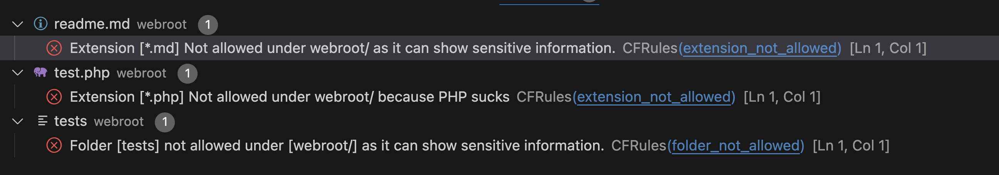

# CFML Formatter

CFML formatter is a Visual Studio Code extension that provides formatting for CFML files using [Lucee Server](https://www.lucee.org/) and [CFFormat]((https://github.com/jcberquist/commandbox-cfformat)

Under the hood it uses a Lucee Language Server to provide the formatting capabilities. 

Why use this extension instad of the [CFFormat](https://www.forgebox.io/view/commandbox-cfformat) commandbox extension?

- You can format your code right in the editor
- You can format your code on save
- You can format your code on right click

We are also including a new project, CFRules which allows a team to share file naming, locations and other rules that can be enforced in VSCode by a whole team.

## Features
- Format CFML files using cfformat right in the editor

- Triggered on Save or via VSCode's `Format Document` command (`Shift` + `Alt` + `F`)

## Development

### Requirements
- Java 11 to run the LSP server
- Ant and Maven
- Node.js and npm
- VS Code and vscx `npm install -g vsce`

### Building and Packaging
- Run `npm run vscode:pacakge`

This will create a cfml-formatter-0.0.1.vsix file in the root of the project. You can install this in VS Code by running `code --install-extension cfml-formatter-0.0.1.vsix`

### Under the hood

The extension is split into a client (written in TypeScript) and a server (written in CFML). The client is responsible for handling the UI and sending requests to the server. The server is responsible for formatting the CFML code.

The Server is a lucee server being run from [App.java](server/src/main/java/org/lucee/App.java) which is an embedded version of tomcat that is packaged up as a .jar file with the whole Language Server Code being written as a Lucee WAR and dynamically expanded. 

Each instance of VSCode will start it's own server on a different port. This is by design as VSCode extensions are responsible for the subprocess (running `java -jar resources/lucee_lsp-1.0-all.jar`) and start and stop instances with each new Workspace window that is opened.

The client is responsible for sending  textDocument and workspace requests to the server and then handling the responses. The LSP is basically the "brains" of the extension and uses CFFormat and CFTokens to format the code as well as doing other functions that a LSP can do. 

## Known Issues
- We dont check for the java version and assume you have Java 11 installed, if you dont you will see an error in the output window

### CFFormat and CFRules files
So that you can manage how you want your code to be formatted, you can create a `.cfformat.json` file in the root of your project. You can read more about cfFormat [here](https://www.forgebox.io/view/commandbox-cfformat). An easy way to create `.cfformat.json` file is to run `box cfformat settings wizard" and it will generate the file for you.

### CFRules
CFRules is a tiny project that allows you to control how your team writes code. You can create a `.cfrules.json` file in the root of your project and it will be picked up by the extension. 

The rules are split into workspace rules (which define the locations of files and folders) and file rules (which define rules around content in the files).

#### Workspace Rules
##### extension_not_allowed
The `extension_not_allowed` checks for file extensions defined in the `value` key of the rule an makes sure that it is not present in the directory defied in the `path` key

examples:

```json
{
    "workspace": [
        {
            "type": "extension_not_allowed",
            "path": "webroot/",
            "value": "*.md",
            "severity": 1,
            "message": "Extension [*.md] Not allowed under webroot/ as it can show sensitive information.",
            "href": "https://yourdocumentation/document.html"
        },
        {
            "type": "extension_not_allowed",
            "path": "webroot/",
            "value": "*.php",
            "severity": 1,
            "message": "Extension [*.php] Not allowed under webroot/ because PHP sucks"
        },
    ],
    ...
}
```
This would display an error if a file with a `.md` or `.php` extension was found in the `webroot` directory



`extension_not_allowed` rule definition:

- "type": "extension_not_allowed"
- "path": relative path to the directory you want to check from the workspace root
- "value": the extension you want to check for, you can use wildcards like `*.md` and add multiple extensions like `*.md|*.php` (it is using [`directoryList`](https://docs.lucee.org/reference/functions/directorylist.html) under the covers)
- "severity": 1-4, 1 is an error, 2 is a warning,  3 is an information message and 4 is a hint.
- "message": The message you want to display in the problems window
- "href": A link to your documentation, to explain the rule to developers

##### folder_not_allowed
The `folder_not_allowed` checks for folders defined in the `value` key of the rule and makes sure that it is not present in the directory defined in the `path` key


examples:

```json
{
    "workspace": [
        {
            "type": "folder_not_allowed",
            "path": "webroot/",
            "value": "tests",
            "severity": 1,
            "message": "Folder [tests] not allowed under [webroot/] as it can show sensitive information."
        }
    ],
    ...
}

`folder_not_allowed` rule definition:

- "type": "folder_not_allowed"
- "path": relative path to the directory you want to check from the workspace root
- "value": the folder name you want to check for. It will check sub folders too. 
- "severity": 1-4, 1 is an error, 2 is a warning,  3 is an information message and 4 is a hint.
- "message": The message you want to display in the problems window
- "href": A link to your documentation, to explain the rule to developers


#### File Rules
TBD. See: https://github.com/cybersonic/vscode-cfml-formatter/issues/3
