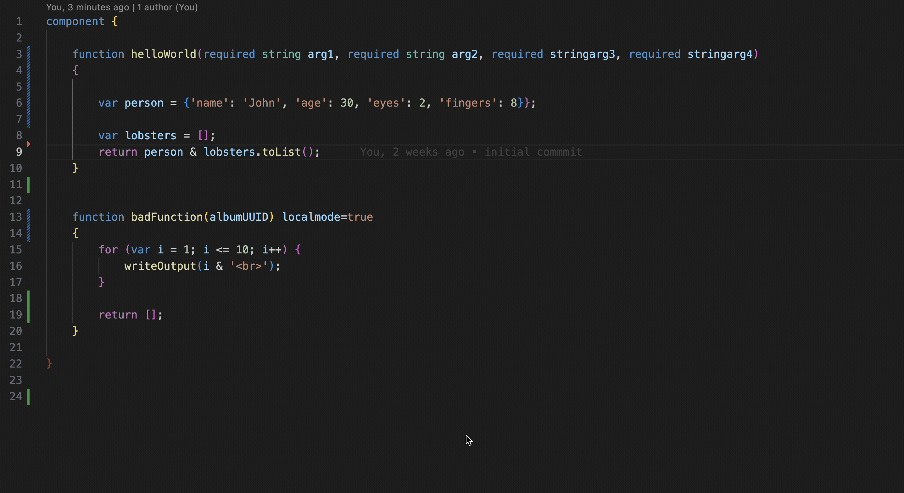

# CFML Formatter

CFML formatter is a Visual Studio Code extension that provides formatting for CFML files using [Lucee Server](https://www.lucee.org/) and [CFFormat](https://github.com/jcberquist/commandbox-cfformat)

Under the hood it uses a Lucee Language Server to provide the formatting capabilities.

## Features

- Format CFML files using cfformat right in the editor

- Triggered on Save or via VSCode's `Format Document` command (`Shift` + `Alt` + `F`)

## Development

### Requirements

- Java 11 to run the LSP server
- Ant and Maven
- Node.js and npm
- VS Code and vscx

### Building and Packaging

- Run `npm run vscode:package`
- Run `ant` or `mvn package` in the `server/` folder to build the project, it will create a Lucee `war` file and a `jar` file for the language server

### Deploying to Tomcat (WIP)

Copy the `server/disp/lucee_lsp.war` file into the  `/tomcat/webapps` folder of an existing Lucee tomcat install, Tomcat will auto deploy the war, if it doesn't try restarting Tomcat.

You can then access the homepage at [http://127.0.0.1:8888/lucee_lsp/](http://127.0.0.1:8888/lucee_lsp/)

In addition, you will need the [Lucee extension-lsp](https://github.com/lucee/extension-lsp) which isn't published yet, but can be manually checked out and built locally using `mvn package`, then copying the `.lex` file into your Lucee's servers deploy folder.

[Language Server Protocol (LSP) for Lucee](https://docs.lucee.org/recipes/language-server.html)
